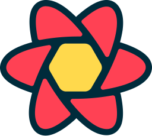

# Hi there, I'm Mariano 

<!-- 
 -->

<h3 >Systems Engineering student - Full Stack developer</h3> 

- 📫 How to reach me **amarianochavez@gmail.com**
- 💪🏼 I'm always trying to learn something new
- 🥁 Fun fact **I play the drums**

<h3>Connect with me</h3>

  
  
  

<!-- <h3 align="center">Some languages and tools I use</h3>

  
  
  
  
  
  
  
  
  
  

  
  
  
  
  
  
  
  
  
  

 

  

  

  

 -->
